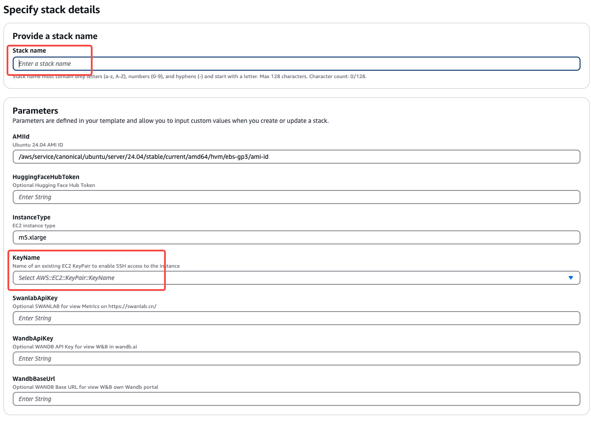
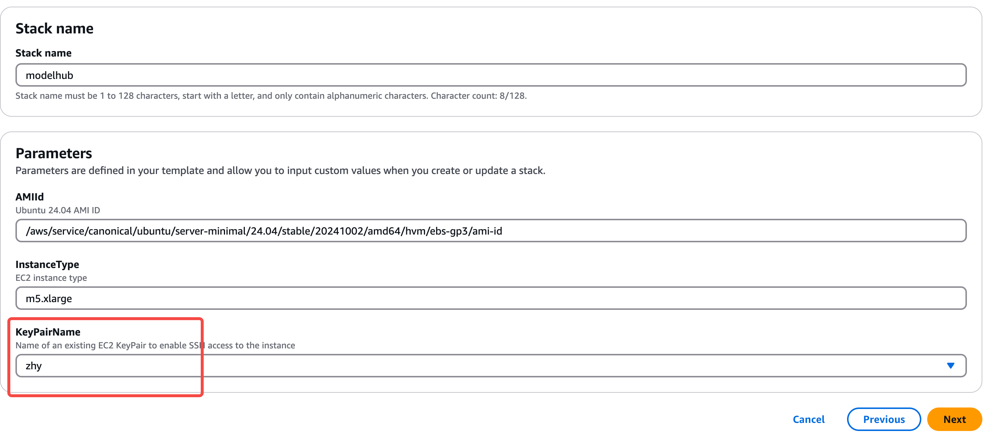
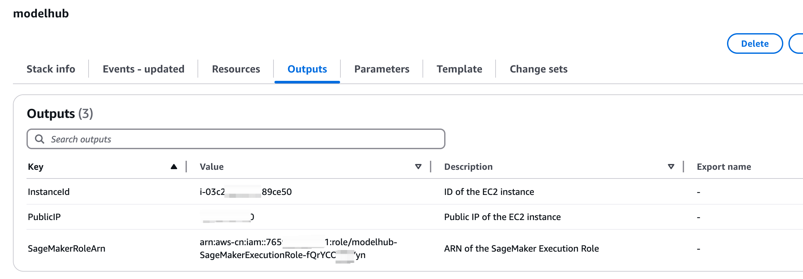

# Model Hub
Model Hub V2是提供一站式的模型微调，部署，调试的无代码可视化平台，可以帮助用户快速验证微调各类开源模型的效果，方便用户快速实验和决策，降低用户微调大模型的门槛。详情请见[飞书使用说明](https://amzn-chn.feishu.cn/docx/QniUdr7FroxShfxeoPacLJKtnXf)

# 请选用以下方式部署：
# 1.Global Region 请选择CloudFormation全自动化部署
- 进入CloudFormation创建一个stack,选择上传部署文件[cloudformation-template.yaml](./cloudformation-template.yaml)

- 必填项包括，stack名，例如modelhub，选择一个ec2 key pairs (如果没有请提前去ec2控制台创建一个)
- 其他根据情况选填，也可以后期在backend/.env中添加，添加完成之后用`pm2 restart all`命令重启生效

- 一直下一步，直到勾选确认框，然后提交  
  
- 配置完成后，等待stack创建完成，从Stack output栏找到PublicIP地址，然后访问http://{ip}:3000访问modelhub,默认用户名demo_user  
  
- 密码获取：进入AWS System Manager->Parameter Store服务控制台，可以看到多了一个/modelhub/RandomPassword,进入之后打开Show decrypted value开关，获取登陆密码，默认用户名是  
  
- ⚠️注意，stack显示部署完成之后，启动的EC2还需要8-10分钟自动运行一些脚本，如果不行，请等待8-10分钟，然后刷新页面  
  

# 2. 北京/宁夏 请选择CloudFormation+一键安装脚本部署
- 中国区由于无法直接用github，所以部署分为两步，首先使用cloudformation创建ec2服务器和role，然后下载项目代码上传至ec2服务器，运行一键安装脚本。
## 第一步 CloudFormation安装
- 首先，进入CloudFormation创建一个stack,选择上传部署文件[cloudformation-template-cn.yaml](./cloudformation-template-cn.yaml)
- 填入一个stack名，例如modelhub,选择一个keypair文件用于ssh到ec2实例（如果没有已有的，则需要到ec2控制台事先创建好）

- 大约几分钟部署完成，在output页卡找到ec2 PublicIP和SageMakerRoleArn信息，后面会用到


## 第二步 下载代码上传至ec2服务器，并运行一键安装脚本
- 请先在能访问github的电脑环境中执行以下命令下载代码，然后把代码打包成zip文件，上传到ec2服务器的/home/ubuntu/下。
- ⚠️注意：需要使用--recurse-submodule下载代码
```bash
git clone --recurse-submodule https://github.com/aws-samples/llm_model_hub.git
```
- zip项目并上传至第一步创建的ec2服务器的/home/ubuntu目录下
```bash
zip -r llm_model_hub.zip llm_model_hub/
scp -i <path_to_your_keypair_file> llm_model_hub.zip ubuntu@<第一步中获取的PublicIP>:~/
```
- 在本地终端中通过ssh到第一步创建的ec2, 注意ssh时添加-o ServerAliveInterval=60命令，防止安装脚本时，终端超时断开
```bash
ssh -i <path_to_your_keypair_file> -o ServerAliveInterval=60 ubuntu@<第一步中获取的PublicIP>:~/
```
- 登陆到ec2之后，解压上传的zip包
```bash
sudo apt update
sudo apt install unzip
unzip llm_model_hub.zip
```

- 设置环境变量
```sh
export SageMakerRoleArn=<第一步cloudformation output里SageMakerRoleArn信息,如 arn:aws-cn:iam:1234567890:role/sagemaker_exection_role>
```
- （可选）如需要设置Swanlab或者wandb作为metrics监控看板,也可以后期在backend/.env中添加，添加之后运行pm2 restart all重启服务
```sh
export SWANLAB_API_KEY=<SWANLAB_API_KEY>
export WANDB_API_KEY=<WANDB_API_KEY>
export WANDB_BASE_URL=<WANDB_BASE_URL>
```

- 执行一键部署脚本
```bash
cd /home/ubuntu/llm_model_hub
bash cn-region-deploy.sh
```  
大约40~60分钟（取决于docker镜像网站速度）之后执行完成，可以在/home/ubuntu/setup.log中查看安装日志。

- 访问
- 以上都部署完成后，前端启动之后，可以通过浏览器访问http://{ec2 PublicIP}:3000访问前端，/home/ubuntu/setup.log中查看用户名和随机密码
- 如果需要做端口转发，则参考[后端配置](./backend/README.md)中的nginx配置部分


# 3.手动部署(北京/宁夏Region)
## 1.环境安装
- 硬件需求：一台ec2 Instance, m5.xlarge, 200GB EBS storage
- os需求：ubuntu 22.04
- 配置权限：
1. 在IAM中创建一个ec2 role :adminrole-for-ec2.
- select trust type: AWS service, service: EC2, 
- 添加以下2个服务的权限，AmazonSageMakerFullAccess， CloudWatchLogsFullAccess
- 
- 
- 
- 把ec2 instance attach到role
-   


2. 创建一个AmazonSageMaker service role: sagemaker_exection_role


- 找到刚才的role，创建一个inline policy
- 
- 
```json
{
    "Version": "2012-10-17",
    "Statement": [
        {
            "Effect": "Allow",
            "Action": [
                "s3:GetObject",
                "s3:PutObject",
                "s3:DeleteObject",
                "s3:ListBucket",
                "s3:CreateBucket"
            ],
            "Resource": [
                "*"
            ]
        },
        {
            "Effect": "Allow",
            "Action": [
                "ssmmessages:CreateControlChannel"
            ],
            "Resource": [
                "*"
            ]
        }
    ]
}
```
- ssh 到ec2 instance
- 如果是中国区需要手动下载代码并打包传到ec2中
- 请先在能访问github的环境中执行以下命令下载代码，然后把代码打包成zip文件，上传到ec2服务器的/home/ubuntu/下。
- 使用--recurse-submodule下载代码  
```bash
git clone --recurse-submodule https://github.com/aws-samples/llm_model_hub.git
```
## 2.ssh登陆到ec2服务器，解压到/home/ubuntu/目录
```sh
unzip llm_model_hub.zip
```

## 3.设置环境变量
```sh
export SageMakerRoleArn=<上面步骤创建的sagemaker_exection_role的完整arn,如 arn:aws-cn:iam:1234567890:role/sagemaker_exection_role>
```
- （可选）如需要设置Swanlab或者wandb作为metrics监控看板,也可以后期在backend/.env中添加，添加之后运行pm2 restart all重启服务
```sh
export SWANLAB_API_KEY=<SWANLAB_API_KEY>
export WANDB_API_KEY=<WANDB_API_KEY>
export WANDB_BASE_URL=<WANDB_BASE_URL>
```

## 4.执行脚本
```bash
cd /home/ubuntu/llm_model_hub
bash cn-region-deploy.sh
```
大约40~60分钟（取决于docker镜像网站速度）之后执行完成，可以在/home/ubuntu/setup.log中查看安装日志。

## 5.访问
- 以上都部署完成后，前端启动之后，可以通过浏览器访问http://{ip}:3000访问前端，/home/ubuntu/setup.log中查看用户名和随机密码
- 如果需要做端口转发，则参考[后端配置](./backend/README.md)中的nginx配置部分


# 如何升级？
- **方法 1**. 下载新的cloudformation 模板进行重新部署，大约12分钟部署完成一个全新的modelhub (此方法以前的job 任务数据会丢失)
- **方法 2**. 
1. 使用一键升级脚本（1.0.6之后支持）：
```bash
cd /home/ubuntu/llm_model_hub/backend/
bash 03.upgrade.sh
```
- **方法 3**. 手动更新：
1. 更新代码, 重新打包byoc镜像
```bash
git pull
git submodule update --remote
cd /home/ubuntu/llm_model_hub/backend/byoc
bash build_and_push.sh 
```
2. 重启服务
```bash
pm2 restart all
```
4. 更新完成

# 访问内置的db查看用户名等信息？
```bash
docker exec -it hub-mysql mysql -ullmdata -pllmdata
```
进入mysql cli之后：  
```
use llm;
show tables;
select * from USER_TABLE;
```

# 示例代码免责声明
本软件按"原样"提供，不提供任何形式的明示或暗示保证，包括但不限于对适销性、特定用途适用性和非侵权性的保证。在任何情况下，无论是在合同诉讼、侵权行为或其他方面，作者或版权持有人均不对任何索赔、损害或其他责任负责，这些索赔、损害或其他责任源于本软件或与本软件的使用或其他交易有关。

THE SOFTWARE IS PROVIDED "AS IS", WITHOUT WARRANTY OF ANY KIND, EXPRESS OR
IMPLIED, INCLUDING BUT NOT LIMITED TO THE WARRANTIES OF MERCHANTABILITY, FITNESS
FOR A PARTICULAR PURPOSE AND NONINFRINGEMENT. IN NO EVENT SHALL THE AUTHORS OR
COPYRIGHT HOLDERS BE LIABLE FOR ANY CLAIM, DAMAGES OR OTHER LIABILITY, WHETHER
IN AN ACTION OF CONTRACT, TORT OR OTHERWISE, ARISING FROM, OUT OF OR IN
CONNECTION WITH THE SOFTWARE OR THE USE OR OTHER DEALINGS IN THE SOFTWARE.