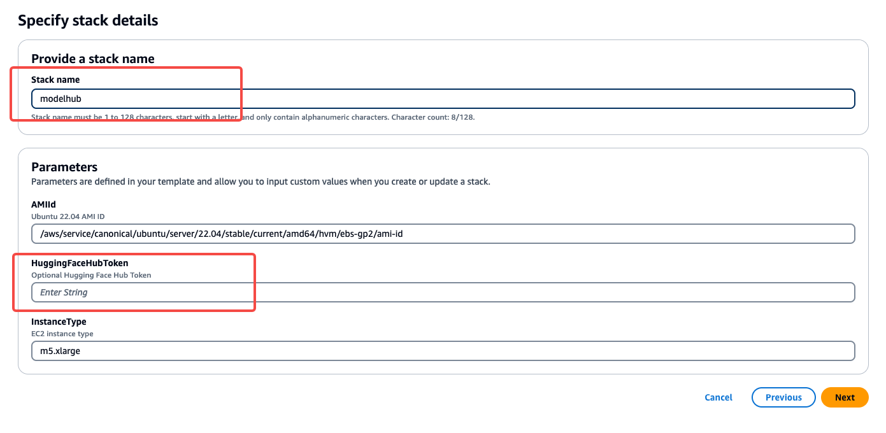

# Model Hub
Model Hub V2是提供一站式的模型微调，部署，调试的无代码可视化平台，可以帮助用户快速验证微调各类开源模型的效果，方便用户快速实验和决策，降低用户微调大模型的门槛。详情请见[飞书使用说明](https://amzn-chn.feishu.cn/docx/QniUdr7FroxShfxeoPacLJKtnXf)

# 请选用以下方式部署：
# 1.自动化部署(暂不支持中国区)
- 进入CloudFormation创建一个stack,选择上传部署文件[cloudformation-template.yaml](./cloudformation-template.yaml)

- 填入一个stack名，例如modelhub, 和HuggingFaceHubToken(可选)

- 一直下一步，直到勾选确认框，然后提交

- 配置完成后，等待stack创建完成，从Stack output栏找到PublicIP地址，然后访问http://{ip}:3000访问modelhub,默认用户名demo_user

- 密码获取：进入AWS System Manager->Parameter Store服务控制台，可以看到多了一个/modelhub/RandomPassword,进入之后打开Show decrypted value开关，获取登陆密码，默认用户名是

- ⚠️注意，stack显示部署完成之后，启动的EC2还需要8-10分钟自动运行一些脚本，如果不行，请等待8-10分钟，然后刷新页面


# 2.手动部署
## 1.环境安装
- 硬件需求：一台ec2 Instance, m5.xlarge, 200GB EBS storage
- os需求：ubuntu 22.04
- 配置权限：
1. 在IAM中创建一个ec2 role :adminrole-for-ec2.
- select trust type: AWS service, service: EC2, 
- 添加以下2个服务的权限，AmazonSageMakerFullAccess， CloudWatchLogsFullAccess
- 
- 
- 
- 把ec2 instance attach到role
-   


2. 创建一个AmazonSageMaker service role: sagemaker_exection_role


- 找到刚才的role，创建一个inline policy
- 
- 
- 注意，如果是中国区，需要把 "arn:aws:s3:::*"改成 "arn:aws-cn:s3:::sagemaker*"
```json
{
    "Version": "2012-10-17",
    "Statement": [
        {
            "Effect": "Allow",
            "Action": [
                "s3:GetObject",
                "s3:PutObject",
                "s3:DeleteObject",
                "s3:ListBucket",
                "s3:CreateBucket"
            ],
            "Resource": [
                "arn:aws:s3:::*"
            ]
        }
    ]
}
```
- ssh 到ec2 instance

- 如果是中国区，请先设置git代理
```bash
git config --global url."https://gitclone.com/".insteadOf https://
```
- 使用--recurse-submodule下载代码  
```bash
git clone --recurse-submodule https://github.com/aws-samples/llm_model_hub.git
```

## 2.部署前端
1. 安装nodejs 18
```bash
curl -fsSL https://deb.nodesource.com/setup_18.x | sudo -E bash -
sudo apt install -y nodejs
sudo npm install --global yarn
```
2. 配置环境变量
- copy llm_model_hub/env.sample 到 .env 文件,修改ip改成对应的ec2的ip，随机给一个api key，这个key需要与下一部分后端配置backend/.env中的apikey保持一致
```
REACT_APP_API_ENDPOINT=http://{ip}:8000/v1
REACT_APP_API_KEY=随机给一个key
```


3. 启动web page
- 安装yarn
```bash
yarn install
```

```bash
#install pm2
sudo yarn global add pm2
pm2 start pm2run.config.js 
```
- 以下是其他的管理命令(作为参考，不用执行):
```bash
pm2 list
pm2 stop modelhub
pm2 restart modelhub
pm2 delete modelhub
```

## 3.后端配置
请见[后端配置](./backend/README.md)

## 4.启动前端
- 以上都部署完成后，前端启动之后，可以通过浏览器访问http://{ip}:3000访问前端
- 如果需要做端口转发，则参考后端配置中的nginx配置部分


# 如何升级？
- **方法 1**. 下载新的cloudformation 模板进行重新部署，大约12分钟部署完成一个全新的modelhub (此方法以前的job 任务数据会丢失)
- **方法 2**. 
1. 使用一键升级脚本（1.0.6之后支持）：
```bash
cd /home/ubuntu/llm_model_hub/backend/
bash 03.upgrade.sh
```
- **方法 3**. 手动更新：
1. 更新代码, 重新打包byoc镜像
```bash
git pull
git submodule update --remote
cd /home/ubuntu/llm_model_hub/backend/byoc
bash build_and_push.sh 
```
2. 重启服务
```bash
pm2 restart all
```
4. 更新完成