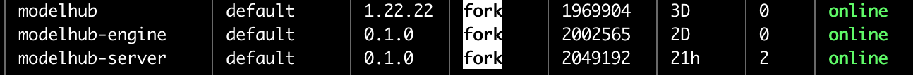

# 后端环境安装
## 0. 中国区说明（海外区可以跳过）
1. 如果在中国区部署，请手动修改python库安装源
- backend/requirements.txt和
- backend/LLaMA-Factory/requirements.txt文件
- 分别在这2个requirements.txt中的第一行添加以下内容
```
-i https://pypi.tuna.tsinghua.edu.cn/simple
```

2. 另外，在backend/LLaMA-Factory/requirements.txt文件中
把原有的  
```
unsloth[cu121-torch220] @ git+https://github.com/unslothai/unsloth.git
```
替换成： 
```
unsloth[cu121-torch220] @ git+https://gitclone.com/github.com/unslothai/unsloth.git
```

3. 配置Docker中国区镜像
- 使用vim添加 /etc/docker/daemon.json 文件并添加上下内容
```bash
sudo vim /etc/docker/daemon.json 
```
```json
{ 
  "registry-mirrors" : 
    [ 
      "https://docker.m.daocloud.io", 
      "https://noohub.ru", 
      "https://huecker.io",
      "https://dockerhub.timeweb.cloud" 
    ] 
}
```
修改保存之后，再重启docker服务
```bash
sudo systemctl restart docker
```


## 1.安装后端环境
1. 进入backend目录,复制env.sample 文件为.env
```bash
cd backend
cp env.sample .env
```
2. 修改编辑.env文件
```bash
vim .env
```
* 1.如果ec2已经绑定了role，则无需填写AK，SK和profile
* 2.修改region为实际region
* 3.修改role为之前在IAM中创建的sagemaker execution role的arn
* 4.修改api_keys为上一级目录中.env中的api key，前后端保持一致
* 5.有些模型(如LLaMA等)需要提供HUGGING_FACE_HUB_TOKEN，请在.env中添加
```bash
AK=
SK=
profile=
region=us-east-1
role=arn:aws:iam::
db_host=127.0.0.1
db_name=llm
db_user=llmdata
db_password=llmdata
api_keys=
HUGGING_FACE_HUB_TOKEN=
```

2. 仍然在backend/目录下执行以下命令进行安装
```bash
bash 01.setup.sh
```

## 2.添加用户
- 仍然在backend/目录下执行以下python脚本命令添加用户
```bash
source ../miniconda3/bin/activate py311
conda activate py311
python3 users/add_user.py your_username your_password default
```
请自行添加用户和密码，并保存到安全的位置。


## 3.后台启动进程
- 执行以下命令启动后台进程
```bash
bash 02.start_backend.sh
```
- 以下命令查看后台进程是否启动成功
```bash
pm2 list
```
modelhub是前端进程，modelhub-engine和modelhub-server是后端进程



## 4.安装nginx（可选）
- 安装nginx
```bash
sudo apt update 
sudo apt install nginx
```

- 创建nginx配置文件  
目的：
  让后端webserver Listens on port 443 without SSL  
  Forwards requests to your application running on localhost:8000  

注意需要把xxx.compute.amazonaws.com改成实际的ec2 dns名称
```bash 
sudo vim /etc/nginx/sites-available/modelhub
```

```nginx
server {
    listen 80;
    server_name xxx.compute.amazonaws.com;
    location / {
        proxy_pass http://localhost:3000;
        proxy_set_header Host $host;
        proxy_set_header X-Real-IP $remote_addr;
        proxy_set_header X-Forwarded-For $proxy_add_x_forwarded_for;
        proxy_set_header X-Forwarded-Proto $scheme;
    }
}

server {
    listen 443;
    server_name xxx.compute.amazonaws.com;

    location / {
        proxy_pass http://localhost:8000;
        proxy_set_header Host $host;
        proxy_set_header X-Real-IP $remote_addr;
        proxy_set_header X-Forwarded-For $proxy_add_x_forwarded_for;
        proxy_set_header X-Forwarded-Proto $scheme;
    }
}
```

- 更改server name bucket size 
- 打开nginx配置文件
```bash
sudo vim /etc/nginx/nginx.conf
```
- 把server_names_hash_bucket_size 改成256
```nginx
http {
    server_names_hash_bucket_size 256;
    # ... other configurations ...
}
```

- 生效配置:
```bash
sudo ln -s /etc/nginx/sites-available/modelhub /etc/nginx/sites-enabled/ 
sudo nginx -t 
sudo systemctl restart nginx
```