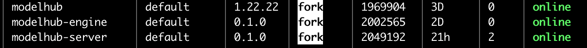

# Backend Environment Installation
## 0. Notes for China Region (Overseas regions can skip)
1. If deploying in China region, please execute the following script first to modify pip source and docker source.
```bash
bash 0.setup-cn.sh
```

## 1. Install Backend Environment
1. Enter backend directory, copy env.sample file to .env
```bash
cd backend
cp env.sample .env
```
2. Modify and edit .env file
```bash
vim .env
```
* 1. If EC2 is already bound to a role, no need to fill in AK, SK and profile
* 2. Modify region to actual region
* 3. Modify role to the arn of the sagemaker execution role created earlier in IAM
* 4. Modify api_keys to match the api key in the parent directory's .env file, keep frontend and backend consistent
* 5. Some models (like LLaMA etc.) require HUGGING_FACE_HUB_TOKEN, please add it to .env
```bash
AK=
SK=
profile=
region=us-east-1
role=arn:aws:iam::
db_host=127.0.0.1
db_name=llm
db_user=llmdata
db_password=llmdata
api_keys=
HUGGING_FACE_HUB_TOKEN=
WANDB_API_KEY=
WANDB_BASE_URL=
MAX_MODEL_LEN=4096
```

2. Still in backend/ directory, execute the following command to install
```bash
bash 01.setup.sh
```

- 2.1 Package vllm inference image
```bash
cd ~/llm_model_hub/backend/byoc
bash build_and_push.sh
source ../../miniconda3/bin/activate py311
conda activate py311
pip install -U sagemaker
python3 startup.py
```

## 2. Add Users
- Still in backend/ directory, execute the following Python script command to add users
```bash
cd ~/llm_model_hub/backend/
source ../miniconda3/bin/activate py311
conda activate py311
python3 users/add_user.py your_username your_password default
```
Please add your own username and password, and save them in a secure location.

## 3. Start Background Processes
- Execute the following command to start background processes
```bash
bash 02.start_backend.sh
```
- Use the following command to check if background processes started successfully
```bash
pm2 list
```
modelhub is the frontend process, modelhub-engine and modelhub-server are backend processes


## 4. Install nginx (Optional)
- Install nginx
```bash
sudo apt update
sudo apt install nginx
```

- Create nginx configuration file
Purpose:
  Let backend webserver Listen on port 443 without SSL
  Forward requests to your application running on localhost:8000

Note: Need to change xxx.compute.amazonaws.com to actual EC2 DNS name
```bash
sudo vim /etc/nginx/sites-available/modelhub
```

```nginx
server {
    listen 80;
    server_name xxx.compute.amazonaws.com;
    location / {
        proxy_pass http://localhost:3000;
        proxy_set_header Host $host;
        proxy_set_header X-Real-IP $remote_addr;
        proxy_set_header X-Forwarded-For $proxy_add_x_forwarded_for;
        proxy_set_header X-Forwarded-Proto $scheme;
    }
}

server {
    listen 443;
    server_name xxx.compute.amazonaws.com;

    location / {
        proxy_pass http://localhost:8000;
        proxy_set_header Host $host;
        proxy_set_header X-Real-IP $remote_addr;
        proxy_set_header X-Forwarded-For $proxy_add_x_forwarded_for;
        proxy_set_header X-Forwarded-Proto $scheme;
    }
}
```

- Change server name bucket size
- Open nginx configuration file
```bash
sudo vim /etc/nginx/nginx.conf
```
- Change server_names_hash_bucket_size to 256
```nginx
http {
    server_names_hash_bucket_size 256;
    # ... other configurations ...
}
```

- Apply configuration:
```bash
sudo ln -s /etc/nginx/sites-available/modelhub /etc/nginx/sites-enabled/
sudo nginx -t
sudo systemctl restart nginx
```